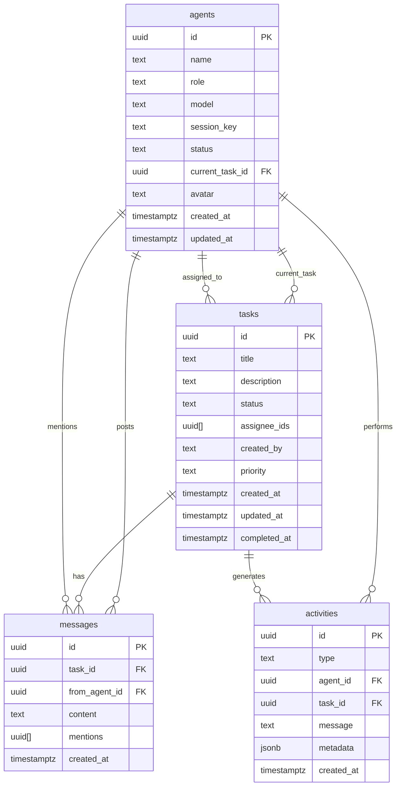

# Mission Control - Database Schema Documentation

## Overview
This document describes the Supabase database schema for the Mission Control dashboard, which provides real-time visibility and coordination for AI agents.

## Table Relationships



## Table Details

### 1. `agents` - AI Agent Squad Members
**Purpose:** Track the status and identity of each AI agent in the squad.

| Column | Type | Description | Constraints |
|--------|------|-------------|-------------|
| `id` | UUID | Primary key | `PRIMARY KEY`, `DEFAULT uuid_generate_v4()` |
| `name` | TEXT | Agent name (Sage, Friday, etc.) | `NOT NULL` |
| `role` | TEXT | Agent role/description | `NOT NULL` |
| `model` | TEXT | AI model used | `NOT NULL` |
| `session_key` | TEXT | OpenClaw session identifier | |
| `status` | TEXT | Current status | `NOT NULL DEFAULT 'idle'`, `CHECK (status IN ('idle', 'active', 'thinking', 'blocked'))` |
| `current_task_id` | UUID | Currently working task | `REFERENCES tasks(id) ON DELETE SET NULL` |
| `avatar` | TEXT | Emoji or image URL | `DEFAULT '🤖'` |
| `created_at` | TIMESTAMPTZ | Creation timestamp | `NOT NULL DEFAULT NOW()` |
| `updated_at` | TIMESTAMPTZ | Last update timestamp | `NOT NULL DEFAULT NOW()` |

**Indexes:**
- `idx_agents_status` - Filter by status
- `idx_agents_session_key` - Lookup by session key
- `idx_agents_current_task_id` - Join with tasks

### 2. `tasks` - Kanban Board Tasks
**Purpose:** Manage tasks across the workflow (inbox → assigned → in_progress → review → done).

| Column | Type | Description | Constraints |
|--------|------|-------------|-------------|
| `id` | UUID | Primary key | `PRIMARY KEY`, `DEFAULT uuid_generate_v4()` |
| `title` | TEXT | Task title | `NOT NULL` |
| `description` | TEXT | Detailed description | |
| `status` | TEXT | Workflow status | `NOT NULL DEFAULT 'inbox'`, `CHECK (status IN ('inbox', 'assigned', 'in_progress', 'review', 'done'))` |
| `assignee_ids` | UUID[] | Array of agent IDs assigned | `DEFAULT '{}'` |
| `created_by` | TEXT | Creator identifier | `NOT NULL DEFAULT 'sage'` |
| `priority` | TEXT | Task priority | `NOT NULL DEFAULT 'medium'`, `CHECK (priority IN ('low', 'medium', 'high'))` |
| `created_at` | TIMESTAMPTZ | Creation timestamp | `NOT NULL DEFAULT NOW()` |
| `updated_at` | TIMESTAMPTZ | Last update timestamp | `NOT NULL DEFAULT NOW()` |
| `completed_at` | TIMESTAMPTZ | Completion timestamp | |

**Indexes:**
- `idx_tasks_status` - Filter by status
- `idx_tasks_created_by` - Filter by creator
- `idx_tasks_priority` - Filter by priority
- `idx_tasks_created_at` - Sort by creation time
- `idx_tasks_updated_at` - Sort by update time

### 3. `messages` - Task Comments
**Purpose:** Store comments and communication on tasks, including @mentions.

| Column | Type | Description | Constraints |
|--------|------|-------------|-------------|
| `id` | UUID | Primary key | `PRIMARY KEY`, `DEFAULT uuid_generate_v4()` |
| `task_id` | UUID | Associated task | `NOT NULL`, `REFERENCES tasks(id) ON DELETE CASCADE` |
| `from_agent_id` | UUID | Comment author | `REFERENCES agents(id) ON DELETE SET NULL` |
| `content` | TEXT | Comment content | `NOT NULL` |
| `mentions` | UUID[] | Array of mentioned agent IDs | `DEFAULT '{}'` |
| `created_at` | TIMESTAMPTZ | Creation timestamp | `NOT NULL DEFAULT NOW()` |

**Indexes:**
- `idx_messages_task_id` - Filter by task
- `idx_messages_from_agent_id` - Filter by author
- `idx_messages_created_at` - Sort by creation time

### 4. `activities` - Real-time Activity Feed
**Purpose:** Record all significant events for the live activity feed.

| Column | Type | Description | Constraints |
|--------|------|-------------|-------------|
| `id` | UUID | Primary key | `PRIMARY KEY`, `DEFAULT uuid_generate_v4()` |
| `type` | TEXT | Event type | `NOT NULL` |
| `agent_id` | UUID | Related agent | `REFERENCES agents(id) ON DELETE SET NULL` |
| `task_id` | UUID | Related task | `REFERENCES tasks(id) ON DELETE SET NULL` |
| `message` | TEXT | Human-readable description | `NOT NULL` |
| `metadata` | JSONB | Additional event data | `DEFAULT '{}'::jsonb` |
| `created_at` | TIMESTAMPTZ | Creation timestamp | `NOT NULL DEFAULT NOW()` |

**Common `type` values:**
- `agent_activated` - Agent started working
- `agent_status_changed` - Agent status updated
- `task_created` - New task created
- `task_assigned` - Task assigned to agent(s)
- `task_status_changed` - Task moved between columns
- `comment_posted` - New message posted
- `mention` - Agent mentioned in comment
- `task_completed` - Task marked as done

**Indexes:**
- `idx_activities_type` - Filter by event type
- `idx_activities_agent_id` - Filter by agent
- `idx_activities_task_id` - Filter by task
- `idx_activities_created_at` - Sort by creation time

## Row Level Security (RLS) Policies

All tables have RLS enabled with the following policies:

### Read Access (Public)
- `SELECT` allowed for everyone on all tables
- This enables the dashboard to be viewable without authentication

### Write Access (Authenticated Only)
- `INSERT`, `UPDATE`, `DELETE` require `auth.role() = 'authenticated'`
- In practice, this means:
  - Sage (the main agent) can write via service role key
  - Other agents can write via their authenticated sessions
  - Public users can only read

## Real-time Configuration

All tables are added to the `supabase_realtime` publication:

```sql
ALTER PUBLICATION supabase_realtime ADD TABLE agents;
ALTER PUBLICATION supabase_realtime ADD TABLE tasks;
ALTER PUBLICATION supabase_realtime ADD TABLE messages;
ALTER PUBLICATION supabase_realtime ADD TABLE activities;
```

This enables real-time subscriptions for:
- Agent status changes
- Task updates (drag-and-drop, assignments)
- New comments
- Activity feed events

## Helper Functions

### `update_agent_status(p_agent_id UUID, p_status TEXT, p_current_task_id UUID)`
Updates agent status and automatically logs an activity event.

**Usage:**
```sql
SELECT update_agent_status(
  (SELECT id FROM agents WHERE name = 'Friday'),
  'active',
  (SELECT id FROM tasks WHERE title = 'Build Login Form')
);
```

### `create_task_with_activity(p_title TEXT, p_description TEXT, p_priority TEXT, p_created_by TEXT)`
Creates a task and logs the creation activity, returning the new task ID.

**Usage:**
```sql
SELECT create_task_with_activity(
  'Fix Navigation Bug',
  'Mobile menu not closing on click',
  'high',
  'sage'
);
```

## Triggers

### Automatic `updated_at` Updates
- `update_agents_updated_at` - Updates `agents.updated_at` on any change
- `update_tasks_updated_at` - Updates `tasks.updated_at` on any change

Both use the `update_updated_at_column()` function.

## Seed Data

The system includes seed data for 5 agents:

| Name | Role | Model | Session Key | Avatar | Default Status |
|------|------|-------|-------------|--------|----------------|
| Sage | Squad Lead / Orchestrator | claude-sonnet-4-5 | agent:main:main | 🧠 | active |
| Friday | Coding Agent | grok-code-fast-1 | agent:coding:main | 💻 | idle |
| Loki | Copy Agent | gpt-4o | agent:copy:main | 📝 | idle |
| Vision | Researcher Agent | gemini-2.0-flash | agent:research:main | 🔍 | idle |
| Fury | Web/Social Search Agent | grok-4.2 | agent:search:main | 🌐 | idle |

## Common Queries

### Get Agent Dashboard
```sql
SELECT a.*, 
  t.title as current_task_title,
  t.status as current_task_status
FROM agents a
LEFT JOIN tasks t ON a.current_task_id = t.id
ORDER BY 
  CASE a.status
    WHEN 'active' THEN 1
    WHEN 'thinking' THEN 2
    WHEN 'blocked' THEN 3
    WHEN 'idle' THEN 4
  END,
  a.created_at;
```

### Get Kanban Board
```sql
SELECT t.*,
  array_agg(a.name) as assignee_names,
  COUNT(m.id) as comment_count,
  MAX(m.created_at) as last_activity
FROM tasks t
LEFT JOIN agents a ON a.id = ANY(t.assignee_ids)
LEFT JOIN messages m ON m.task_id = t.id
GROUP BY t.id
ORDER BY 
  CASE t.status
    WHEN 'in_progress' THEN 1
    WHEN 'review' THEN 2
    WHEN 'assigned' THEN 3
    WHEN 'inbox' THEN 4
    WHEN 'done' THEN 5
  END,
  CASE t.priority
    WHEN 'high' THEN 1
    WHEN 'medium' THEN 2
    WHEN 'low' THEN 3
  END,
  t.created_at DESC;
```

### Get Activity Feed
```sql
SELECT a.type, a.message, ag.name as agent_name, 
  ag.avatar as agent_avatar, t.title as task_title,
  a.created_at
FROM activities a
LEFT JOIN agents ag ON a.agent_id = ag.id
LEFT JOIN tasks t ON a.task_id = t.id
ORDER BY a.created_at DESC
LIMIT 50;
```

### Get Task Thread
```sql
SELECT m.content, a.name as author, a.avatar as author_avatar,
  array_agg(ma.name) as mentioned_agents,
  m.created_at
FROM messages m
LEFT JOIN agents a ON m.from_agent_id = a.id
LEFT JOIN agents ma ON ma.id = ANY(m.mentions)
WHERE m.task_id = 'task-uuid-here'
GROUP BY m.id, a.name, a.avatar
ORDER BY m.created_at ASC;
```

## Integration Notes

### Agent Lifecycle
1. **Idle** → **Active**: When Sage spawns an agent
2. **Active** → **Thinking**: When agent makes API calls
3. **Thinking** → **Active**: When agent returns to processing
4. **Active** → **Idle**: When agent completes work

### Task Workflow
1. **inbox**: New, unassigned task
2. **assigned**: Has assignee(s), not started
3. **in_progress**: Being worked on
4. **review**: Completed, needs approval
5. **done**: Approved and closed

### Real-time Updates
- Frontend should subscribe to all 4 tables
- Use Supabase client's `on('INSERT', ...)` etc.
- Update UI immediately on changes
- Activity feed auto-updates as events occur

## Deployment

### Migration File
`20260201170000_create_mission_control_tables.sql`
- Run in Supabase SQL Editor
- Creates tables, indexes, RLS, real-time config
- Includes seed data for agents

### Seed Data
`seed_mission_control.sql`
- Optional: Run after migration
- Adds sample tasks, messages, activities
- Creates demonstration scenario

### Verification
After deployment:
1. Check tables exist in Table Editor
2. Verify RLS policies in Authentication > Policies
3. Confirm real-time enabled in Replication
4. Test with sample queries above

## Troubleshooting

### Real-time Not Working
1. Check publication: `SELECT * FROM pg_publication_tables WHERE pubname = 'supabase_realtime';`
2. Ensure tables listed: agents, tasks, messages, activities
3. Verify RLS allows reads: `SELECT * FROM agents LIMIT 1;` should work

### RLS Blocking Writes
1. Use service role key for Sage's writes
2. Ensure agents authenticate with proper credentials
3. Check policy: `SELECT * FROM pg_policies WHERE tablename = 'agents';`

### Performance Issues
1. All critical columns indexed
2. Array columns for efficient many-to-many
3. JSONB for flexible metadata
4. Timestamp indexes for sorting

## Future Extensions

### Possible Additions
1. `projects` table for task grouping
2. `attachments` table for file uploads
3. `notifications` table for user alerts
4. `sprints` table for time-boxed work

### Performance Optimizations
1. Materialized views for common queries
2. Partitioning by date for activities
3. Full-text search on task titles/descriptions
4. Caching layer for frequent reads

---

**Last Updated:** 2026-02-01  
**Schema Version:** 1.0  
**Compatible With:** Mission Control Phase 1